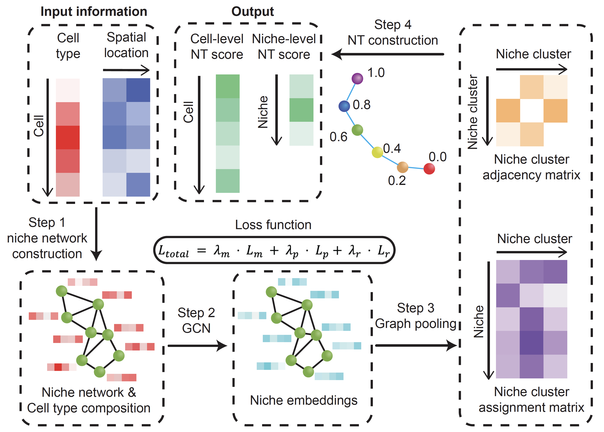

# **ONTraC**

ONTraC (Ordered Niche Trajectory Construction) is a niche-centered, machine learning method for constructing spatially continuous trajectories. ONTraC differs from existing tools in that it treats a niche, rather than an individual cell, as the basic unit for spatial trajectory analysis. In this context, we define niche as a multicellular, spatially localized region where different cell types may coexist and interact with each other.  ONTraC seamlessly integrates cell-type composition and spatial information by using the graph neural network modeling framework. Its output, which is called the niche trajectory, can be viewed as a one dimensional representation of the tissue microenvironment continuum. By disentangling cell-level and niche-level properties, niche trajectory analysis provides a coherent framework to study coordinated responses from all the cells in association with continuous tissue microenvironment variations.



***

## Installation

- Setup environment following the instruction on `Environment_setup.md`
- Install `ONTraC`

  ```{sh}
  git clone https://github.com/wwang-chcn/ONTraC.git
  cd ONTraC && pip install .
  ```

## File Format

### Original_data.csv

This file contains all input formation with five columns: Cell_ID, Sample, Cell_Type, x, and y.

| Cell_ID         | Sample   | Cell_Type | x       | y     |
| --------------- | -------- | --------- | ------- | ----- |
| E12_E1S3_100034 | E12_E1S3 | Fibro     | 15940   | 18584 |
| E12_E1S3_100035 | E12_E1S3 | Fibro     | 15942   | 18623 |
| ...             | ...      | ...       | ...     | ...   |
| E16_E2S7_326412 | E16_E2S7 | Fibro     | 32990.5 | 14475 |

## Citation
